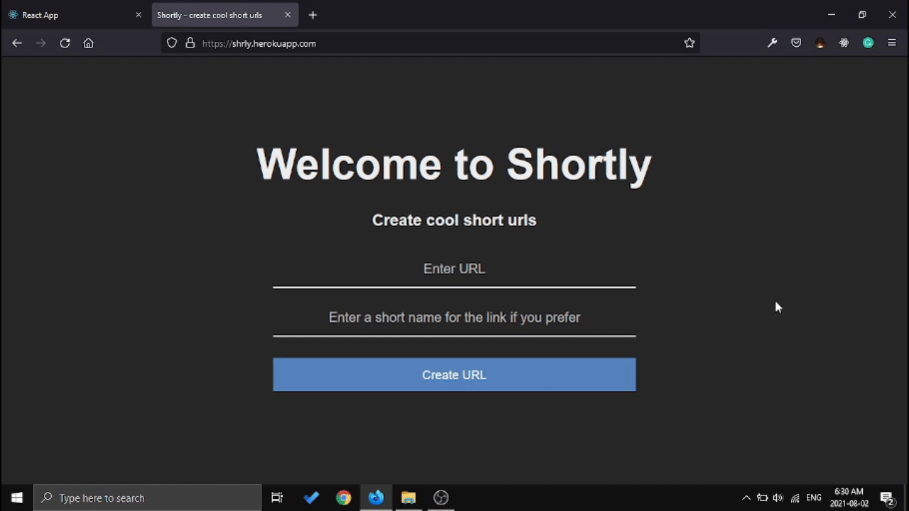

# Shortly

## Description / Short story

A one page web application for creating short links. I made it with Express, Nanoid and Hadlebars.

## Preview



## How To Install

### 1. Clone the project

```bash
git clone https://github.com/alimr70/shortly.git

cd shortly

npm install

npm run dev
```

<hr>

## If you want to try it live, [here](https://shrly.herokuapp.com/).

<hr>

## Contributing

Please help me with the documentation and code improvment. I appreciate that.
